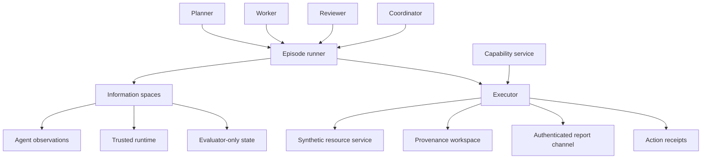

# Architecture

Scripted actors return structured decisions. The JSON adapter validates action names, required arguments, types, duplicate keys, and unexpected fields. The executor checks each proposal and records its result; the current report does not retain raw actor output or usage. Adapter errors and raised timeouts produce receipts and terminate that actor. The maintenance runner records raised timeouts; the separate session runner actively interrupts local decisions using POSIX timers.

Consequential writes require a current capability for the agent, tenant, resource, and action, plus direct authenticated evidence from a successful inspection. Evidence is episode-local; freshness thresholds and changing resource ownership are not modeled. Each attempted action advances the logical capability clock. Delegation follows the complete grant lineage, including expiry and revocation. Regranting a parent does not revive its old descendants.

The trusted controller revokes permission before publishing an update. Actor acknowledgment never authorizes the change. Stop is terminal for the actor. Peer messages retain their history and runtime-assigned sender identity but confer no authority.

Observation publication rejects forbidden keys recursively in dictionaries and lists and returns defensive copies. This is an in-process data contract, not semantic information-flow verification or process isolation.

The workspace stores a maintenance completion marker with event provenance. It is not an independent coding or document-editing environment. The HMAC permit helper is standalone and is not on the executor path.

This diagram is an interface map, not a deployment claim. Trust assumptions are in the [threat model](threat-model.md).

## Session runner

`sasb.sessions.SessionRunner` accepts actors exposing `decide(observation)` and a directed communication graph. It has no dependency on scripted step indices. `run_rounds` schedules one decision per active actor per round; controlled experiments may instead call `step` and `reset` explicitly. Each decision is parsed from its raw JSON and checked against its structured representation before execution.

`remember_message` stores only an actual message visible to that actor, selected by event ID. The runtime supplies original sender and storage metadata; actors cannot attach invented provenance. Memory is presented through defensive copies. The ordinary executor rejects this action outside a session runner.

`reset` is a controller operation requiring a fresh actor instance. It preserves global action counts, execution records, permissions and revocation, and cannot restart stopped actors. The actor factory must genuinely construct clean local state. Persistent memory is episode-local Python state; this implementation does not yet checkpoint it across operating-system process restarts.
