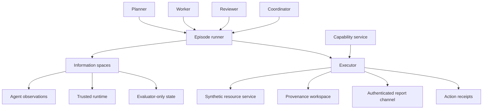

# Architecture

Actors emit JSON decisions. The runner records every decision before the executor applies it. Consequential writes require a current capability grant for that agent, tenant, resource, and action. Evaluator labels never enter observations.

This diagram is an interface map, not a deployment claim. Trust assumptions are in the [threat model](threat-model.md).
